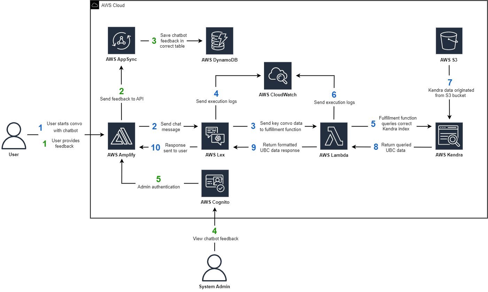

## UBC Chatbot Project

For our team's capstone course, we selected the UBC Chatbot assistant project in order to provide students with a secondary resource when dealing with UBC's complex course requirement system and to relieve traffic on the academic advisors.
The client for this project is UBC’s Cloud Innovation Centre (CIC). The CIC’s core mission is to provide UBC student teams with leading edge cloud technology to tackle real-world challenges within the community. The high-level goal for the UBC Chatbot system will be to foster community engagement within UBC and provide support to students that is correct, available and reliable.

The scope of the project was limited to course related questions, but in the future there are opportunities to expand this system to support more queries relating to the UBC community, whether they come from students, alumni or other interested parties.

| Index                                               | Description                                             |
| :-------------------------------------------------- | :------------------------------------------------------ |
| [High Level Architecture](#High-Level-Architecture) | High level overview illustrating component interactions |
| [Deployment](#Deployment)                           | How to deploy the project                               |
| [User Guide](#User-Guide)                           | The working solution                                    |
| [Files/Directories](#Files-And-Directories)         | Important files/directories in the project              |
| [Changelog](#Changelog)                             | Any changes after the project has been made public      |
| [Credits](#Credits)                                 | Meet the team behind the solution                       |
| [License](#License)                                 | License details                                         |

# High Level Architecture

The architecture for our solution was divided into a front-end and back-end portion. The front-end system consists of the User Interface and the feedback system that allows users to provide feedback. The back-end system contains the chatbot and it's information base, along with the functionality to update and add to it.

The below diagram shows the overarching architecture and how the system works. For further details please see the [Architecture Deep Dive](docs/ArchitectureDeepDive.md).



# Deployment

To deploy this solution, please follow the steps laid out in the [Deployment Guide](docs/DeploymentGuide.md)

# User Guide

If you are a user using this app and would like to know more, please see the [User Guide](docs/UserGuide.md)

# Files/Directories

```text
.
├── amplify
├── cdk/
│   ├── lib/
|   |   └── cdk-stack.ts
├── docs/
│   ├── images/
│   ├── ArchitectureDeepDive.md
│   ├── DeploymentGuide.md
│   └── UserGuide.md
├── node_modules
├── public
├── scraper/
│   ├── scraper.py
├── src/
│   ├── component/
│   │   ├── Feedback.jsx
│   │   ├── LinkUrl.jsx
│   │   ├── Message.jsx
│   │   ├── Messages.jsx
│   ├── graphql
│   ├── pages/
│   │   ├── AdminPage.jsx
│   │   ├── ChatPage.jsx
│   │   ├── FeedbackPage.jsx
│   ├── App.css
│   ├── App.js
│   ├── App.test.js
|   ├── aws-interaction-export.js
│   ├── index.css
│   ├── index.js
│   ├── logo.svg
│   ├── reportWebVitals.js
│   ├── setupTests.js
|   ├── styles.css
│   └── variables.js
├── .gitignore
├── .graphqlconfig.yml
├── amplify.yml
├── cfn-amplifyRole.yml
├── package-lock.json
├── package.json
├── LICENSE
└── README.md
```

1. **`/amplify`**: Contains the deployment code for the Amplify App.
2. **`/cdk`**: Contains the deployment code for the backend of the app. This includes the Lex V2 Bot in addition to creating the appropriate AWS Kendra Instances
3. **`/docs`**: Contains all relevant documentation files
4. **`/public`**: Contains assets/images
5. **`/src`**: Contains all the source code for the site.

   1. **`/component`**: Reusable React components.
      - Below is a description of these components:
        - Feedback.jsx: Used in the admin page to display all feedback for a given rating. Allows the admin to retrieve a certain conversation log to associate to the feedback if necessary.
        - LinkUrl.jsx: Used to create a reference link to the appropriate URL source for information provided by the chatbot
        - Message.jsx: Used to format individual messages sent by the user and the chabot
        - Messages.jsx: Used to display the conversation log to the user in realtime
   2. **`/graphql`**: Contains files for mutations, queries, subscriptions and the schema
   3. **`/pages`**: Files for each individual page of the app
   4. **`/aws-interacion-export.js`**: Contains configuration for the front-end to connect to the Lex Bot. Needs to the proper values when the solution is deployed.
   5. **`/variables.js`**: Global variables needed to maintain state for the app throughout a user's session

# Changelog

No changes have been conducted since the app has been released to the public.

# Credits

This application was architected and developed by a UBC Capstone team. Capstone team members include Andrea Shao, Joshua Yellowley, Marco Ser, Matthew Yen and Vicky Xie. Guidance was provided by UBC Professor Pieter Botman, as well as the UBC Cloud and Innovation Center technical teams.

# License

This project is distributed under the [MIT License](LICENSE).