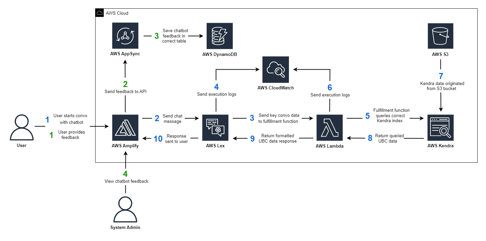

# Backend and Frontend Stack Deep Dive

## Architecture

## Description
### User/bot conversation flow (Blue)
1. The user sends a question to the chatbot. 
2. The text is parsed by Amplify before being passed to Lex. 
3. Lex continues to question the user for key data until the intent is fulfilled. Lex then triggers a Lambda function, sending all this key data (ex: course number, major, faculty, etc).
4. Lex execution logs are sent to CloudWatch for debugging purposes. 
5. The Lambda executed will choose a routine to run based on the understood Lex intent. This routine will query a specific Kendra index for the correct response. 
6. Lambda execution logs are sent to CloudWatch for debugging purposes. 
7. Data stored in Kendra indices are originated from S3 buckets populated by web-scraping. 
8. Kendra returns the unformatted data back to the Lambda handler. 
9. The Lambda handler formats the answer and returns it back to Lex.
10. Lex passes the answer back to Amplify where it is displayed in the frontend. 
### Submitting feedback flow (Green)
