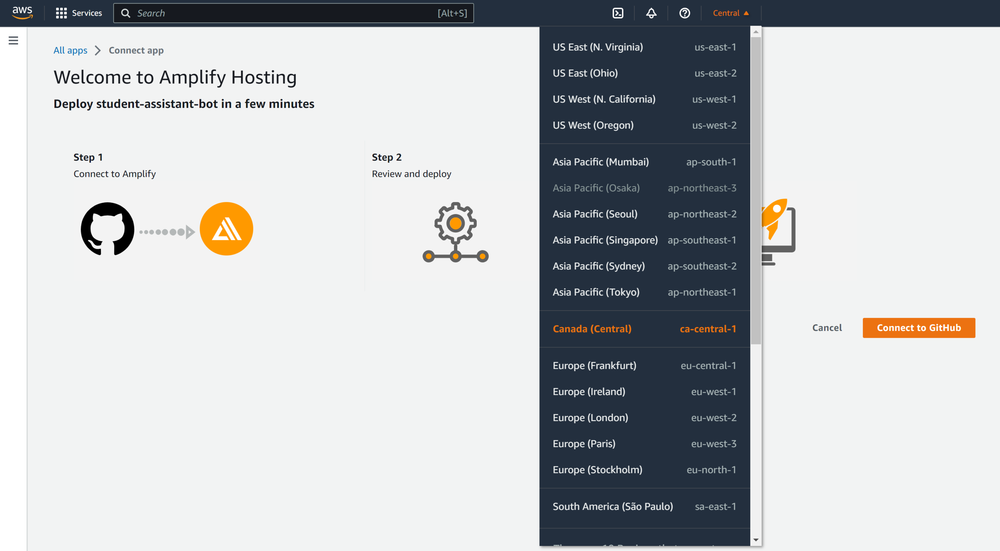
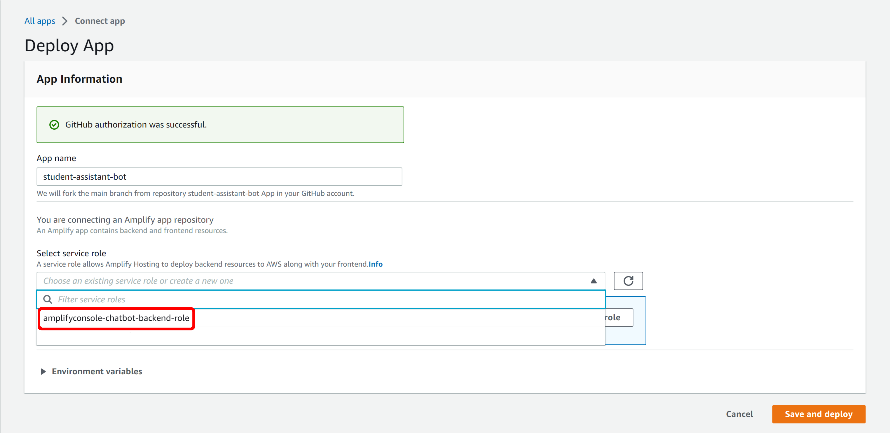
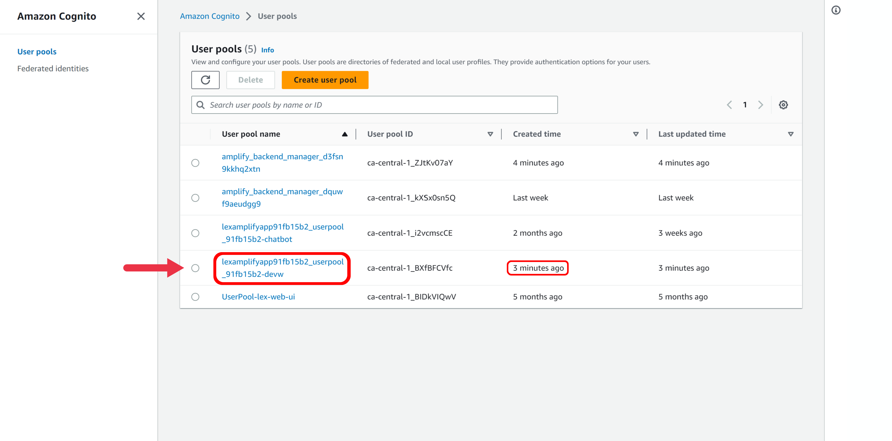
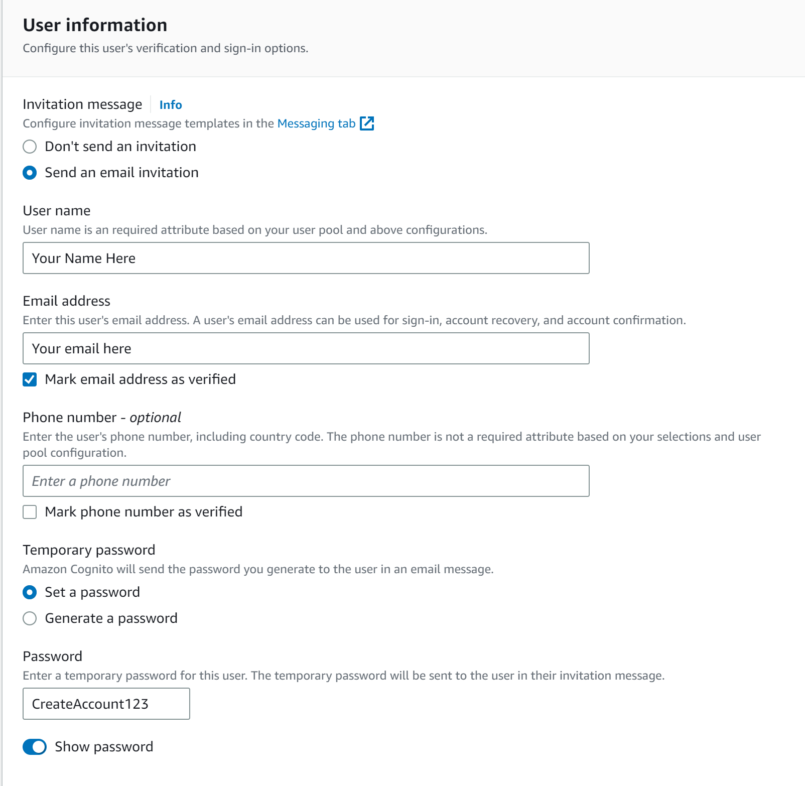

# Requirements

Before you deploy, you must have the following in place:
*  [AWS Account](https://aws.amazon.com/account/) 
*  [GitHub Account](https://github.com/) 
*  [AWS CLI](https://aws.amazon.com/cli/) 
*  [AWS CDK](https://docs.aws.amazon.com/cdk/v2/guide/getting_started.html#getting_started_install)  

# Step 0: Provide AWS CLI Credentials
1. As the cloud formation and the scraper will be access AWS resources we will need to configure the tokens on the command line
```
aws configure sso
```
2. After typing the prompt, fill in the following information:

- SSO session name: (any session name)
- SSO Start URL: https://ubc-cicsso.awsapps.com/start#
- SSO Region: ca-central-1

After you type in the region, it should prompt you to sign up on your browser

3. 
CLI default client Region: ca-central-1
CLI default output format: (blank)
CLI profile name: (any profile name)

# Step 1: Clone The Repository

First, clone the github repository onto your machine. To do this:
1. Create a folder on your desktop to contain the code.
2. Open terminal (or command prompt if on windows) and **cd** into the above folder.
3. Clone the github repository by entering the following:
```bash
git clone https://github.com/UBC-CIC/student-assistance-chatbot.git
```

The code should now be in the above folder. Now navigate into the repository folder by running the following command:
```bash
cd student-assitance-chatbot
```

# Step 2: Backend Deployment
We will have to deploy the backend of our solution first to obtain the chatbot's ID and alias ID before running the frontend.

First we need to enter the cdk folder of the code to deploy the cloudformation stack

```bash
cd cdk
```

Following this, we can deploy the cloudformation stack to our AWS account
```bash
cdk deploy
```

If you have multiple aws profiles, you may need to run 
```bash
cdk deploy --profile <desired aws profile>
```
Note that you may need to enter yes to the console a few times before the solution is deployed to AWS.
The deployment can take anywhere from 30 minutes to an hour as most of the time is spent creating the AWS Kendra indices.

Once deployed, the command will complete and you should be able to find the cloudformation stack on your AWS Account.


# Step 3: Scraper Deployment


1. Install the dependencies using the command:
```bash
pip install -r requirements.txt
```
2. Run the scraper with the following command:
```bash
python scraper.py
```

Note: The scraper code scrapes the courses from the [UBC courses website](https://courses.students.ubc.ca/cs/courseschedule?pname=subjarea). We are able to extract the following information:
* Buildings
* Co-requisites
* Course Number
* Credits
* Date
* Description
* Instructor
* Mode of delivery
* Pre-requisites
* Requires in-person attendance

# Step 4: Frontend Deployment

Before installing Amplify, we need to create the IAM Role that associates the policies needed to implement this solution. 

In the home repository folder, execute the following CloudFormation command:

```bash
aws cloudformation deploy --template-file cfn-amplifyRole.yml --stack-name amplifyconsole-chatbot-backend-role --capabilities CAPABILITY_NAMED_IAM
```

Similar to above, if you have multiple AWS profiles configured, you may have to run:
```bash
aws cloudformation deploy --template-file cfn-amplifyRole.yml --stack-name amplifyconsole-chatbot-backend-role --capabilities CAPABILITY_NAMED_IAM --profile <desired aws profile>
```

This command will create the desired IAM role to deploy the Amplify stack for the front-end.

Once the role has been created, click the button below to launch the amplify app. This button will take you to the AWS console to deploy the app.


[](https://console.aws.amazon.com/amplify/home#/deploy?repo=https://github.com/UBC-CIC/student-assistance-chatbot)


1. On the AWS console, select your desired region before hitting the Connect to Github button.





2. You will be taken to the following page. If your github is not authorized, you will have to authorize it before proceeding. Otherwise, select the `amplifyconsole-chatbot-backend-role` for the backend deployment.





3. The deployment will take a few minutes. Please wait until the deployment status is green. If your build is stuck on the "forking your github repository" step, you can refresh the page and go back to step 2.


4. Now that the app is deployed, you can click the left toolbar to open up the `AWS Amplify` menu. Once there, navigate to the  `Rewrites and Redirects` section and click edit.


5. Add the following rule to your rewrites and redirects.

Source Address: `</^[^.]+$|\.(?!(css|gif|ico|jpg|js|png|txt|svg|woff|woff2|ttf|map|json)$)([^.]+$)/>`

Target Address: `/index.html`

Type: `200 (Rewrite)`

Then hit save.


6. Once this is complete, you can now create your admin account. For this step, you need to log into `AWS Cognito`. Once you are there, you can find the user pool that was created with your Amplify deployment.





7. Once you have found your new user pool, click into and create a new user. Fill in the appropriate fields shown below. Note that the password that you set in the console will be needed to log into the admin page, so please write it down in an appropriate place. If your email is not verified, you will be unable to change your password via our application UI.




8. Once you create the user, complete the email verification step and you should now be able to log into the admin page! For more information on the admin page, please see the [User Guide](./UserGuide.md#admin-page)

# Step 5: Integration of Lex Bot


Congratulations, the deployment of your app is complete!


