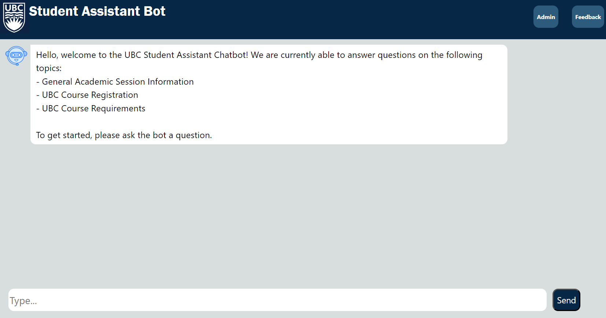

# User Guide

# Requirements
Before you use this app as a user, please ensure you have followed the steps in the [Deployment Guide](./DeploymentGuide.md) and that your application deployment is successful.

| Index                                               | Description                                             |
| :-------------------------------------------------- | :------------------------------------------------------ |
| [Chat Page](#Chat-Page)                             | Landing page of the application                         |
| [Feedback Page](#Feedback-Page)                     | How to submit feedback for the application              |
| [Admin Page](#Admin-Page)                           | How to view user-submitted feedback as a system admin   |

# Chat Page
Once a user has arrived at the landing page, they will arrive at the following page

Here, the chatbot will direct the user to ask any question they desire under the following categories.
Questions can be from the following categories
- General academic UBC questions
- UBC Course descriptions and credit counts
- Course Requirements
- Course Pre-requisites
- Course Co-requisites

# Feedback Page
Upon completion of a conversation, the user has the option to submit feedbacko to improve the chatbot. This can be done by clicking the feedback button on the chat page.

The user will then land on the feedback page where they can submit a rating from 1 stars to 5 stars based on their chatbot experience and leave comments of any type for chatbot improvement.

# Admin Page
If you are a system administrator, you will have access to the admin page provided you have created an admin account following the steps outlinted in the [deployment guide](./DeploymentGuide.md). To get to the admin page, you can click the admin button on the chat page.

Upon logging in as the system admin, you will land upon this page.

As an admin, you can filter feedback based on the user inputted star rating. If you are curious to see why the user left certain feedback, you can explore the user's conversation log by clicking the feedback.

